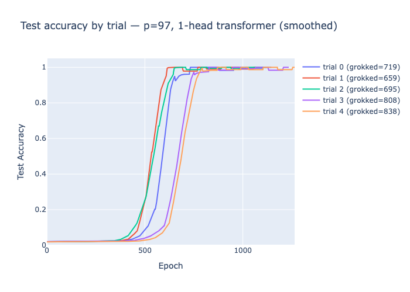
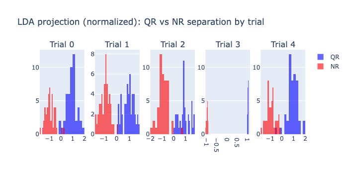
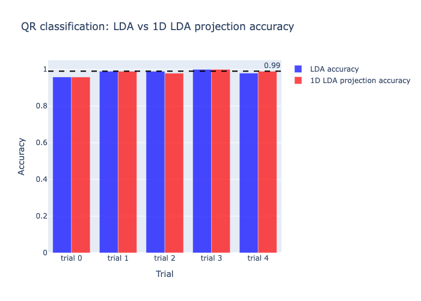

# MechMult

Mechanistic interpretability of grokking transformers on modular multiplication in F_p.

## Finding

The embedding matrix W_E of a 1-layer transformer trained on a*b mod p encodes 
quadratic residue status in a single low-variance linear direction. This direction 
is recoverable by LDA (~0.99 accuracy) but invisible to PCA — meaning weight decay 
selects for a low-variance but perfectly discriminative representation of the 
underlying algebraic structure.

Additional findings:
- Attention acts as a content-independent ~50/50 mixer of the two token embeddings
- The MLP computes QR(ab) exactly using GELU nonlinearity
- Grokking fails monotonically beyond 2 layers for this task

## Structure

- `train.py` — trains 1-layer transformer on a*b mod p, saves checkpoint and metrics
- `analyze.py` — probes W_E for QR encoding via LDA and PCA
- `visualize_loss.py` — plots grokking curves across trials

## Setup

```bash
uv add torch scikit-learn plotly sympy numpy
uv run train.py
uv run analyze.py
```

## Background

Motivated by Nanda et al. (2023) which reverse-engineered the Fourier circuit for 
modular addition. This project investigates whether a similar clean circuit exists 
for multiplication, finding instead a qualitatively different QR-based representation.

## Results

### Grokking curve (p=97, 1-head transformer)


### LDA projection: QR vs NR separation


### QR classification accuracy
